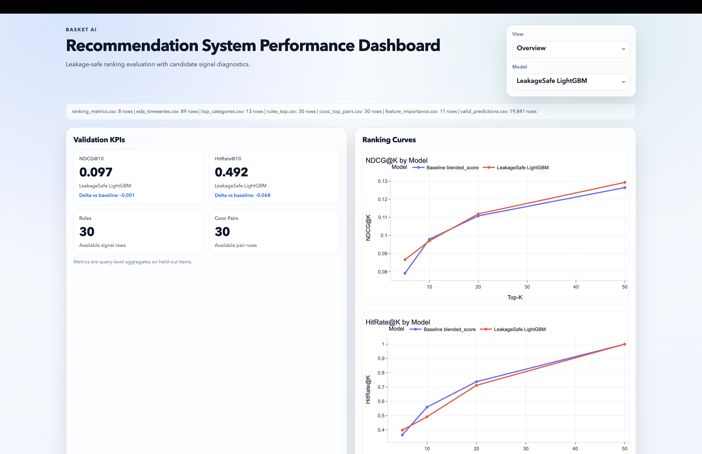
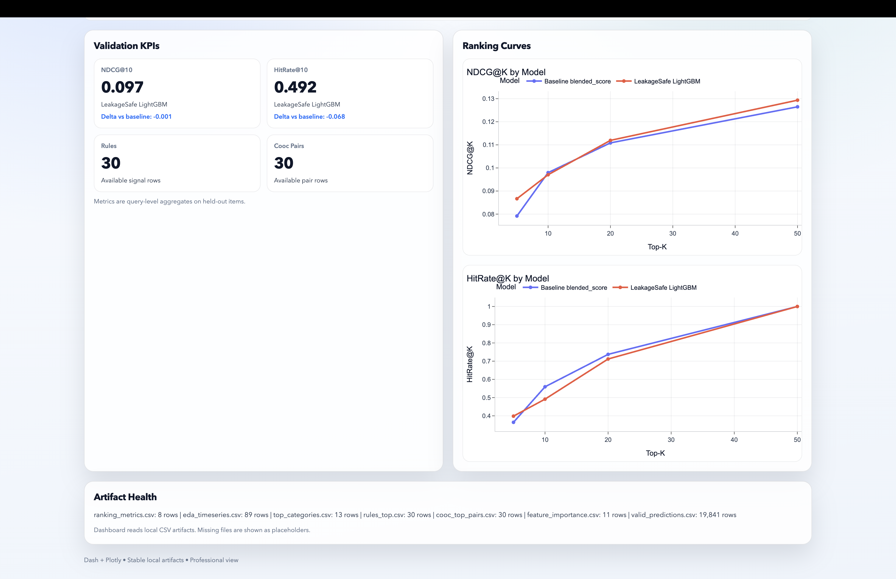
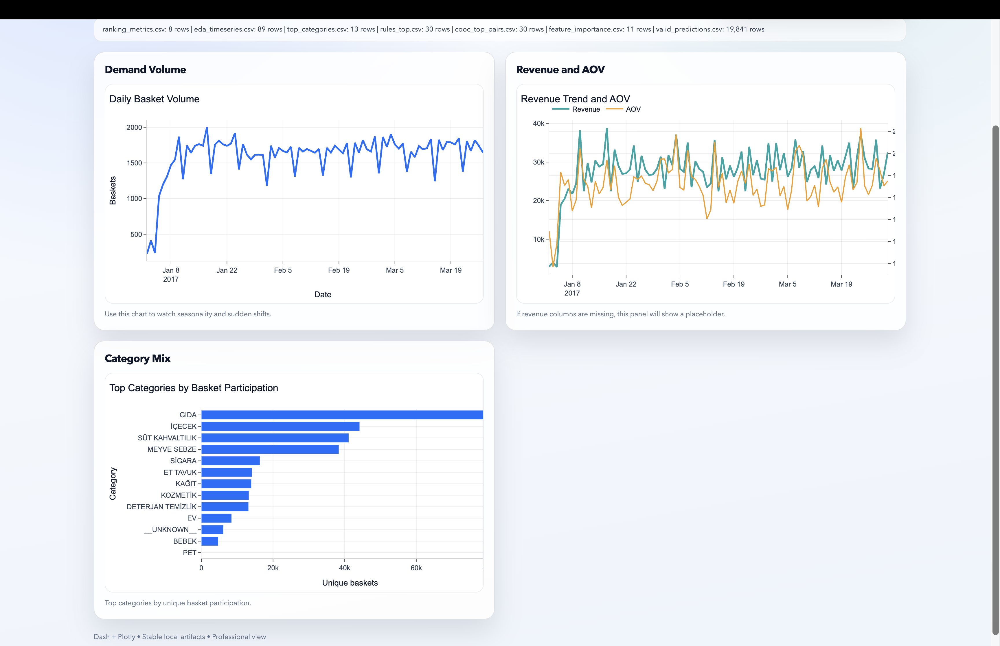
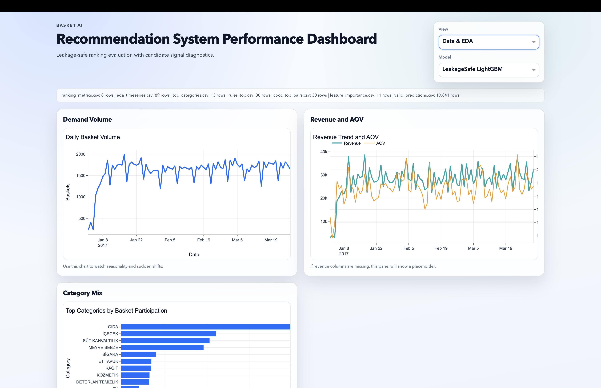
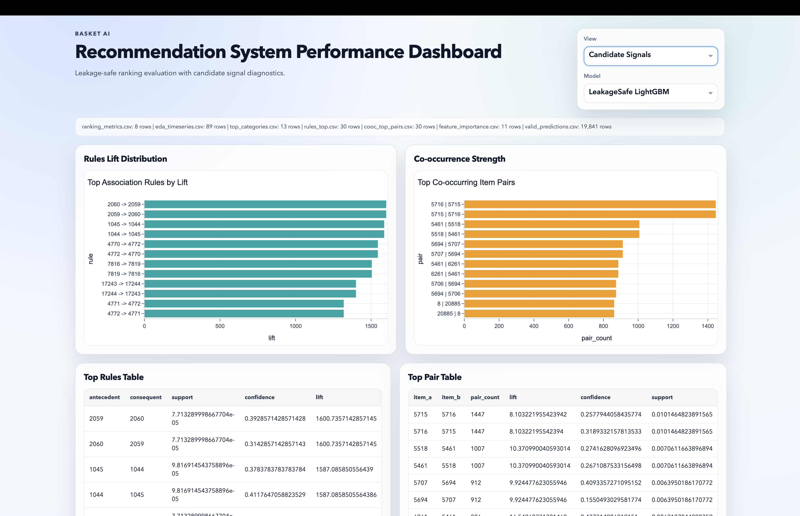
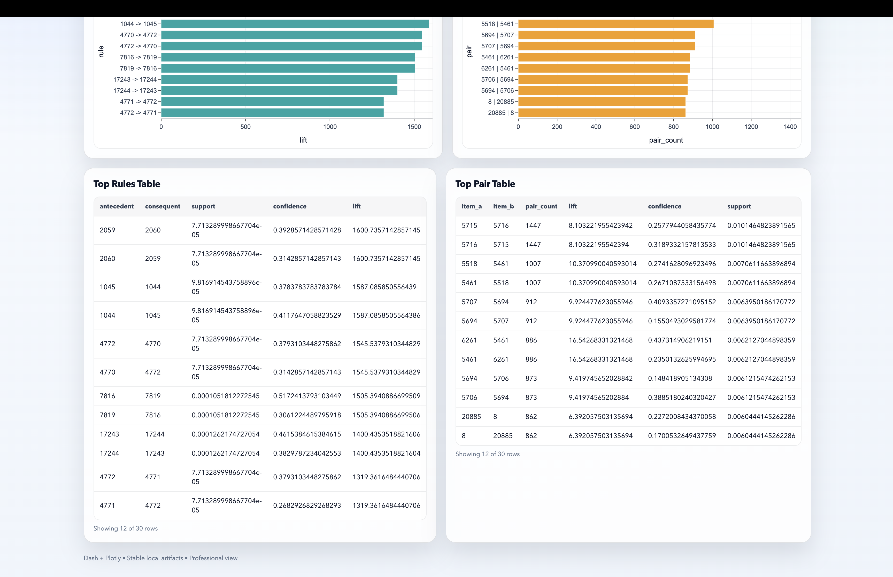
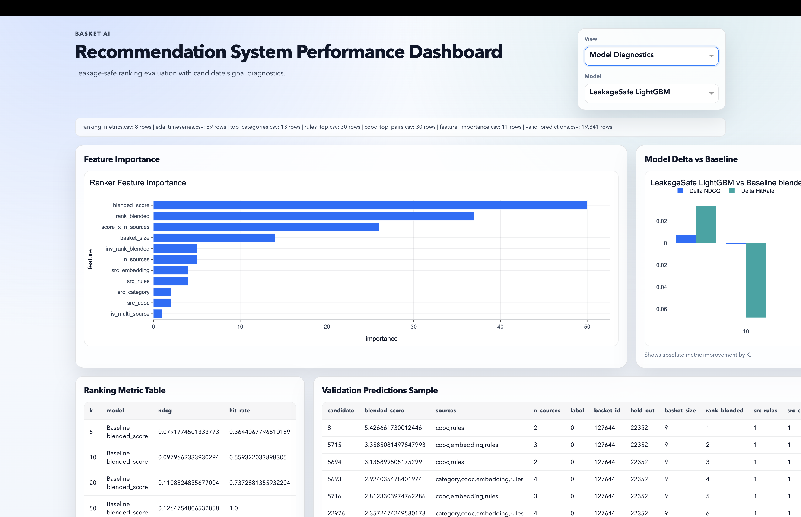
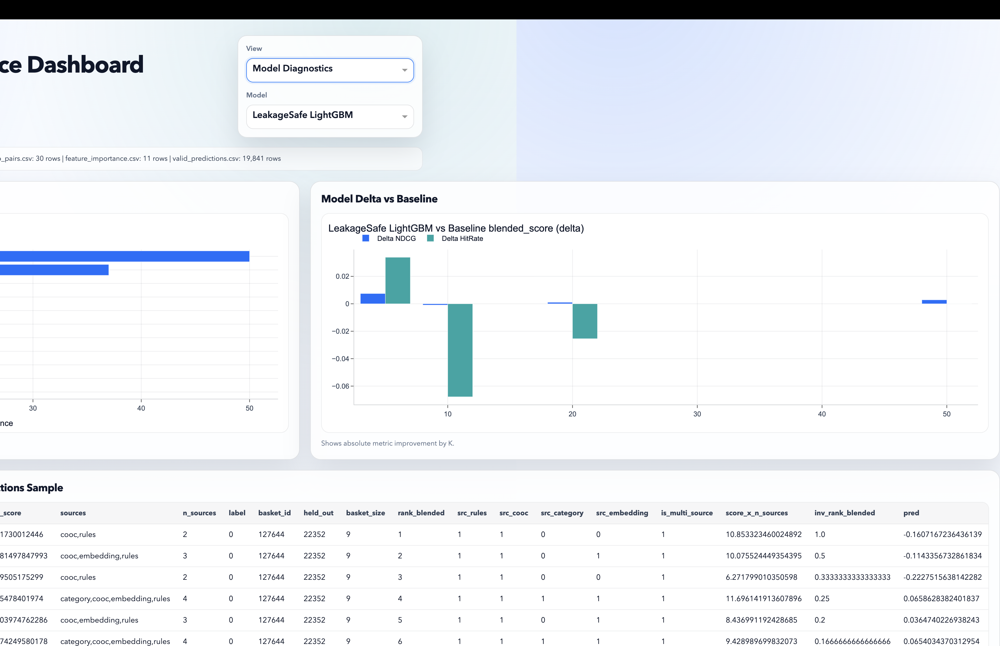
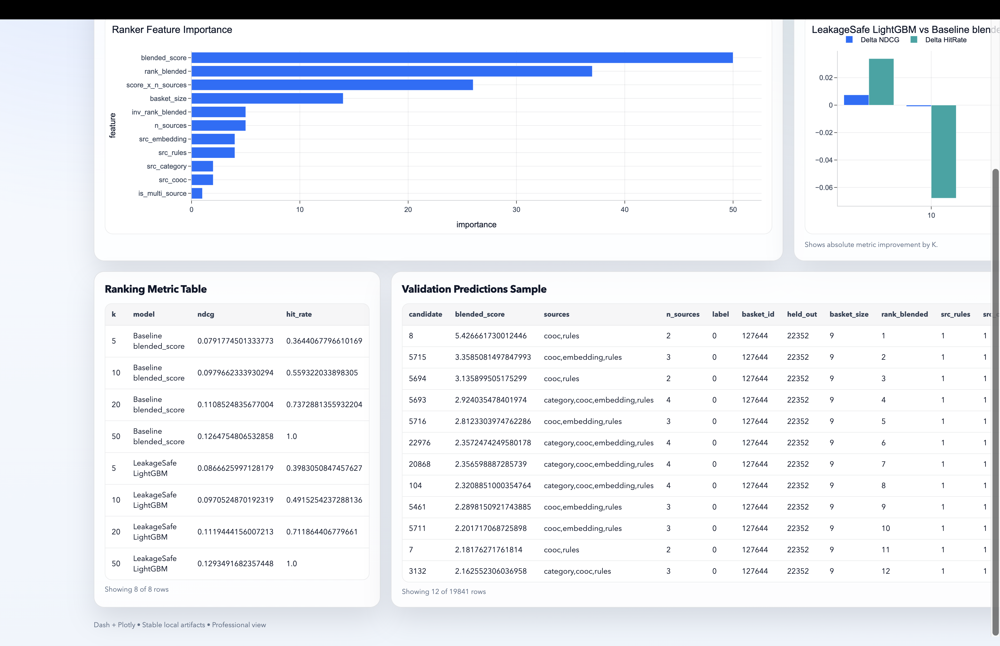
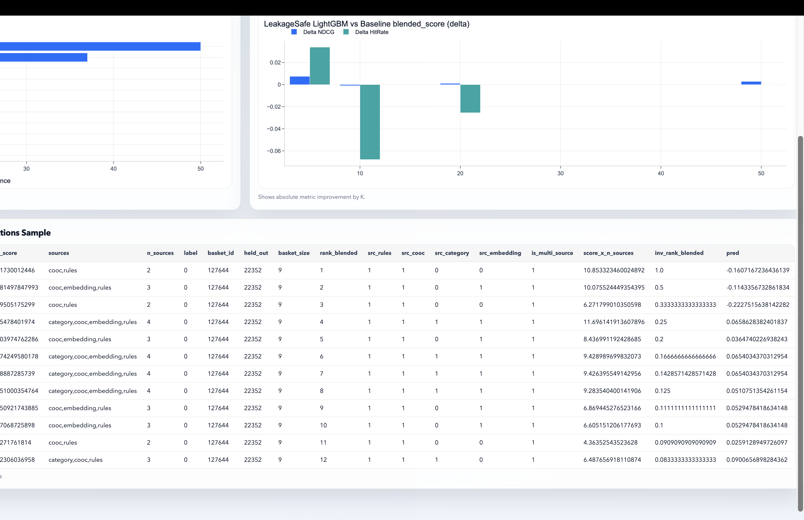

# basket_ai
Production-style **basket recommendation system** with:
- multi-signal candidate generation
- leakage-safe Learning-to-Rank evaluation
- dashboard artifacts and executive monitoring
- dbt analytics layer for BI-ready marts

<!-- Dashboard Screenshots (Top) -->

<p align="center">
  
</p>
<p align="center">
  
</p>

<p align="center">
  
</p>
<p align="center">
  
</p>

<p align="center">
  
</p>
<p align="center">
  
</p>

<p align="center">
  
</p>
<p align="center">
  
</p>
<p align="center">
  
</p>
<p align="center">
  
</p>

<hr/>


This repository is designed to mirror a real recommendation stack where ranking quality depends first on candidate quality, then on robust model ordering.

---

## Table of Contents
1. [Project Scope](#project-scope)
2. [Architecture](#architecture)
3. [Repository Structure](#repository-structure)
4. [Quick Start](#quick-start)
5. [One-Command Production Pipeline](#one-command-production-pipeline)
6. [Detailed Pipeline Steps](#detailed-pipeline-steps)
7. [Data and Privacy](#data-and-privacy)
8. [Leakage-Safe Evaluation Design](#leakage-safe-evaluation-design)
9. [Dashboard](#dashboard)
10. [Analyst Dashboard](#analyst-dashboard)
11. [dbt Layer](#dbt-layer)
12. [Notebooks Policy](#notebooks-policy)
13. [Outputs](#outputs)
14. [Troubleshooting](#troubleshooting)
15. [Roadmap](#roadmap)

---

## Project Scope
`basket_ai` solves a market-basket recommendation workflow end-to-end:

1. Build canonical basket tables from transaction-level sales data.
2. Generate recommendation signals:
  - association rules
  - co-occurrence graph
  - category expansion
  - embedding neighbors (Item2Vec-style)
  - optional trends and external category scrape
3. Train and evaluate a ranking model.
4. Export standardized artifacts for a Dash monitoring app.
5. Model BI-facing marts with dbt.

Core design goals:
- reproducibility
- operational clarity
- privacy-safe synthetic enrichment
- explicit separation of exploration vs production code paths

---

## Architecture
```text
Raw Transactions
  -> Canonical Tables (baskets, basket_items)
  -> Signal Builders (rules / cooc / category / embeddings)
  -> Candidate Generator
  -> Ranker (LightGBM LambdaRank, leakage-safe split)
  -> Evaluation Artifacts (NDCG@K, HitRate@K, feature importance)
  -> Dash Dashboard + dbt marts
```

---

## Repository Structure
```text
basket_ai/
├── src/
│   ├── data_processing/
│   │   └── build_baskets_tables.py
│   └── data_generation/
│       ├── build_synthetic_customers.py
│       ├── build_product_embeddings_item2vec.py
│       ├── build_category_tree_from_marketsales.py
│       ├── google_trends_from_marketsales.py
│       └── scrape_trendyol_category_tree.py
├── scripts/
│   ├── run_production_pipeline.sh
│   ├── train_ranker_leakage_safe.py
│   ├── export_dashboard_artifacts.py
│   ├── export_analyst_dashboard_artifacts.py
│   └── make_phase2_parquets.py
├── dash_app/
│   ├── app.py
│   ├── analyst_app.py
│   ├── assets/style.css
│   └── data/{metrics,analyst}/...
├── basket_ai_dbt/
│   └── models/{staging,intermediate,marts}
├── notebooks/
│   ├── 01_eda_baseline.ipynb
│   ├── 02_models_reco_candidates.ipynb
│   ├── 03_models_ranking.ipynb
│   └── README.md
├── data/
│   ├── external/
│   ├── processed/
│   └── generated/
├── requirements.txt
├── Makefile
└── README.md
```

---

## Quick Start

### Prerequisites
- Python `3.12+`
- `pip`
- GNU `make` (for one-command targets)

Optional:
- dbt + BigQuery profile for analytics layer

### Install dependencies
```bash
pip install -r requirements.txt
```

### See available make targets
```bash
make help
```

---

## One-Command Production Pipeline

Full run:
```bash
make pipeline
```

Fast run (skip embedding retrain):
```bash
make pipeline-fast
```

What `make pipeline` orchestrates:
1. Canonical table build
2. Synthetic customer generation (anonymized)
3. Embedding generation
4. Category tree build
5. Leakage-safe ranker training
6. Dashboard artifact export

The orchestrator is:
- [scripts/run_production_pipeline.sh](scripts/run_production_pipeline.sh)

Supported script flags:
- `--skip-embeddings`
- `--skip-training`
- `--skip-export`
- `--with-trends`
- `--with-trendyol`

---

## Detailed Pipeline Steps

### 1) Build canonical basket tables
```bash
python src/data_processing/build_baskets_tables.py
```
Input:
- `data/processed/transactions/marketsales.parquet`

Outputs:
- `data/processed/baskets/basket_items.parquet`
- `data/processed/baskets/baskets.parquet`

### 2) Generate synthetic customer features (privacy-safe)
```bash
python src/data_generation/build_synthetic_customers.py
```
Outputs:
- `data/generated/synthetic_customers/synthetic_customers.csv`
- `data/generated/synthetic_customers/synthetic_customers.parquet`

### 3) Build embeddings and neighbors
```bash
python src/data_generation/build_product_embeddings_item2vec.py --max-anchor-items 0 --max-neighbors-per-item 20
```
Outputs:
- `data/generated/embeddings/product_embeddings.parquet`
- `data/generated/embeddings/product_neighbors_top20.csv`

### 4) Build category tree
```bash
python src/data_generation/build_category_tree_from_marketsales.py
```
Outputs:
- `data/generated/category_trees/marketsales_category_tree.csv`
- `data/generated/category_trees/marketsales_category_edges.csv`

### 5) Train ranker with leakage-safe setup
```bash
python scripts/train_ranker_leakage_safe.py
```
Outputs:
- `dash_app/data/metrics/ranking_metrics.csv`
- `dash_app/data/feature_importance.csv`
- `dash_app/data/metrics/valid_predictions.csv`
- `dash_app/data/rules_top.csv`
- `dash_app/data/cooc_top_pairs.csv`

### 6) Export science dashboard artifacts
```bash
python scripts/export_dashboard_artifacts.py
```
Outputs:
- `dash_app/data/eda_timeseries.csv`
- `dash_app/data/top_categories.csv`
- `dash_app/data/rules_top.csv`
- `dash_app/data/cooc_top_pairs.csv`

### 7) Export analyst dashboard artifacts
```bash
python scripts/export_analyst_dashboard_artifacts.py
```
Outputs:
- `dash_app/data/analyst/daily_metrics.csv`
- `dash_app/data/analyst/category_daily_metrics.csv`
- `dash_app/data/analyst/category_city_daily_metrics.csv`
- `dash_app/data/analyst/city_daily_metrics.csv`
- `dash_app/data/analyst/top_items.csv`
- `dash_app/data/analyst/top_items_daily.csv`
- `dash_app/data/analyst/quality_daily.csv`
- `dash_app/data/analyst/basket_scope.csv`
- `dash_app/data/analyst/basket_category_bridge.csv`

### 8) Launch dashboards
Science dashboard:
```bash
make dashboard
```
or
```bash
python dash_app/app.py
```

Analyst dashboard:
```bash
make dashboard-analyst
```
or
```bash
python dash_app/analyst_app.py
```

---

## Data and Privacy

Canonical tables:
- `baskets.parquet`
- `basket_items.parquet`

Synthetic enrichment:
- `synthetic_customers` output is **anonymized** (`customer_id` hashed with salt).
- Raw customer names are not exported in synthetic outputs.

Important:
- Large raw/processed/generated data files are excluded from git by `.gitignore`.
- Rebuild artifacts via scripts instead of committing data binaries.

---

## Leakage-Safe Evaluation Design

Production training is not notebook-random split based.

`scripts/train_ranker_leakage_safe.py` applies:
1. Time-based train/validation split by basket date.
2. Signal indices built from **train history only**.
3. Holdout generation on each split separately.
4. Query-grouped ranking metrics (`NDCG@K`, `HitRate@K`).
5. Baseline comparison (`blended_score`) vs LightGBM ranker.

This avoids optimistic metrics caused by signal leakage from future baskets.

---

## Dashboard

Science dashboard app:
- [dash_app/app.py](dash_app/app.py)
- [dash_app/assets/style.css](dash_app/assets/style.css)

Current science dashboard capabilities:
- model selector and baseline delta panels
- ranking curves by K
- feature importance view
- EDA trend cards (volume, revenue, AOV)
- candidate signal summaries and table previews
- robust placeholders for missing artifacts

---

## Analyst Dashboard

Analyst dashboard app:
- [dash_app/analyst_app.py](dash_app/analyst_app.py)
- uses the same visual system in [dash_app/assets/style.css](dash_app/assets/style.css)

Run analyst artifact export:
```bash
make export-analyst-data
```

Launch analyst dashboard:
```bash
make dashboard-analyst
```

Current analyst dashboard capabilities:
- Executive Overview: revenue, basket volume, AOV, and basket diversity KPIs
- Category & Item Performance: category Pareto, top items by revenue, city performance bubble view
- Data Quality & Health: missing-rate trend and last-14-days completeness checks
- linked filters: date range, category, city, and minimum daily basket threshold
- compact scrollable tables with sticky headers for production readability

---

## dbt Layer

dbt project:
- [basket_ai_dbt](basket_ai_dbt)

Model flow:
- `staging` -> `intermediate` -> `marts`

Key models:
- staging: `stg_baskets`, `stg_basket_items`
- intermediate: `int_basket_summary`
- marts:
  - `mrt_daily_kpis`
  - `mrt_customer_summary`
  - `mrt_top_items_daily`
  - `mrt_category_daily_kpis`

Staging models include defensive date parsing for epoch/timestamp variants.

---

## Notebooks Policy

Notebooks are **exploration-only**.

They are intentionally separated from production artifact generation to avoid:
- cell-order side effects
- environment drift
- accidental metric leakage

See:
- [notebooks/README.md](notebooks/README.md)

---

## Outputs

Typical production artifacts:

### Ranking
- `dash_app/data/metrics/ranking_metrics.csv`
- `dash_app/data/metrics/valid_predictions.csv`
- `dash_app/data/feature_importance.csv`

### Signals
- `dash_app/data/rules_top.csv`
- `dash_app/data/cooc_top_pairs.csv`

### EDA
- `dash_app/data/eda_timeseries.csv`
- `dash_app/data/top_categories.csv`

### Analyst Dashboard
- `dash_app/data/analyst/daily_metrics.csv`
- `dash_app/data/analyst/category_daily_metrics.csv`
- `dash_app/data/analyst/category_city_daily_metrics.csv`
- `dash_app/data/analyst/city_daily_metrics.csv`
- `dash_app/data/analyst/top_items.csv`
- `dash_app/data/analyst/top_items_daily.csv`
- `dash_app/data/analyst/quality_daily.csv`
- `dash_app/data/analyst/basket_scope.csv`
- `dash_app/data/analyst/basket_category_bridge.csv`

---

## Troubleshooting

### `main...origin/main [behind N]` before push
Run:
```bash
git pull --rebase origin main
```
Then push:
```bash
git push origin main
```

### Matplotlib cache warning
Set writable cache path:
```bash
export MPLCONFIGDIR=/tmp/matplotlib
```

### CPU core detection warning (joblib/loky on macOS sandbox)
Optional:
```bash
export LOKY_MAX_CPU_COUNT=4
```

### Missing artifacts in dashboard
Re-run:
```bash
make pipeline-fast
```

### Missing artifacts in analyst dashboard
Re-run:
```bash
make export-analyst-data
```

---

## Roadmap

- richer ranking features (temporal and sequence-aware)
- user-aware personalization features
- lightweight API serving layer (FastAPI)
- CI checks for pipeline consistency and artifact schema validation
- automated drift diagnostics in dashboard

---

## Author

Gizem Totkanlı  
Data Scientist (Machine Learning / AI)
